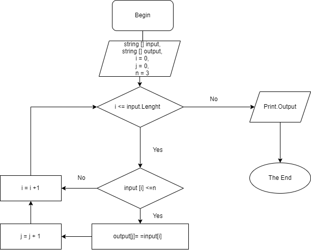

# *Итоговая проверочная работа*
## *Задача*:
Написать программу, которая из имеющегося массива строк формирует массив из строк, длина которых меньше либо равна 3 символа.

> Первоначальный массив можно ввести с клавиатуры, либо задать на старте выполнения алгоритма. При решении не рекомендуется пользоваться коллекциями, лучше обойтись исключительно массивами.

### *Алгоритм решения:*
1. Проверяем каждый элемент исходного массива на соответствие условию: длина строки <= 3. Проверка проводится от 1 до последнего элемента массива;
2. Если строка удовлетворяет заданному условию, передаем значение такой строки в новый массив;
3. После проверки последнего элемента исходного массива возращаем новый массив как результат.

## Блок-схема алгоритма:

